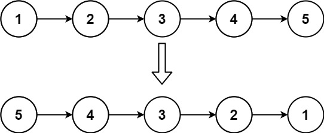

# 206. Reverse Linked List

## Условие

Имея в начале односвязный список, переверните список и верните перевернутый
список.



Example 1:
Input: head = [1,2,3,4,5]
Output: [5,4,3,2,1]

Example 2:
Input: head = [1,2]
Output: [2,1]

## Решение

Отлично, задача **206. Reverse Linked List** (Разворот связного списка) — это *
*«Hello, World!»** для работы с указателями. Если вы её поймёте, 80% остальных
задач на списки станут вам понятны.

Главная сложность здесь в том, что в односвязном списке узел знает только о
следующем, но не о предыдущем. Чтобы развернуть список, нужно **заставить каждый
узел указывать на предыдущий**, а для этого надо запоминать предыдущий узел,
пока мы идём вперёд.

Я покажу **итеративный метод** (самый надёжный и быстрый) и объясню его через *
*три указателя**, а затем кратко — рекурсию.

---

## Методика: «Три указателя» (Prev, Current, Next)

Представьте, что вы идёте по цепочке вагонов и **разворачиваете сцепки**:

- **`prev`** — указатель на уже развёрнутую часть (изначально `null`, потому что
  перед головой ничего нет).
- **`curr`** — указатель на текущий узел, который мы сейчас будем перецеплять (
  изначально это `head`).
- **`nextTemp`** — временный указатель, который запоминает, куда мы должны пойти
  дальше, **ПЕРЕД ТЕМ** как мы перепишем ссылку `curr.next`.

**Алгоритм на пальцах:**

1. Запоминаем следующий узел: `nextTemp = curr.next` (чтобы не потерять хвост).
2. Переворачиваем стрелку: `curr.next = prev` (текущий узел теперь указывает на
   предыдущий).
3. Сдвигаем `prev` вперёд: `prev = curr` (теперь текущий узел стал «предыдущим»
   для следующего шага).
4. Сдвигаем `curr` вперёд: `curr = nextTemp` (переходим к следующему узлу,
   который мы сохранили).
5. Повторяем, пока `curr` не станет `null`. В конце `prev` будет указывать на
   новую голову развёрнутого списка.

---

## Решение на Kotlin (итеративное)

```kotlin
fun reverseList(head: ListNode?): ListNode? {
    var prev: ListNode? = null
    var curr = head

    while (curr != null) {
        val nextTemp = curr.next // 1. Сохраняем следующий узел
        curr.next = prev         // 2. Разворачиваем ссылку
        prev = curr              // 3. Сдвигаем prev на текущий
        curr = nextTemp          // 4. Сдвигаем curr на сохранённый следующий
    }

    return prev // Новая голова
}
```

### Визуализация (для списка 1 -> 2 -> 3 -> null)

| Шаг   | `prev` | `curr` | `nextTemp` | Действие                            |
|-------|--------|--------|------------|-------------------------------------|
| 0     | null   | 1      | -          | -                                   |
| 1     | null   | 1      | 2          | `1.next = null`, `prev=1`, `curr=2` |
| 2     | 1      | 2      | 3          | `2.next = 1`, `prev=2`, `curr=3`    |
| 3     | 2      | 3      | null       | `3.next = 2`, `prev=3`, `curr=null` |
| Конец | 3      | null   | -          | возвращаем `prev` (3)               |

После разворота список стал: 3 -> 2 -> 1 -> null.

---

## Ключевые моменты для запоминания

1. **Без `nextTemp` вы потеряете хвост.** Когда вы пишете `curr.next = prev`, вы
   затираете единственную ссылку на оставшуюся часть списка. Поэтому
   `nextTemp` — обязательный спасательный круг.
2. **Порядок сдвига важен:** сначала `prev = curr`, затем `curr = nextTemp`.
   Если поменять местами, вы потеряете текущий узел.
3. **Сложность:** O(n) по времени, O(1) по памяти — мы не создаём новые узлы,
   только переставляем ссылки.
4. **Пустой список** обрабатывается корректно: цикл не выполняется, возвращается
   `null`.

---

## Альтернатива: Рекурсия (для понимания)

Рекурсивный способ тоже часто просят в интервью, но он использует стек вызовов
глубиной O(n), что может привести к переполнению стека для больших списков.
Однако он элегантен:

```kotlin
fun reverseList(head: ListNode?): ListNode? {
    if (head?.next == null) return head // Базовый случай: пустой или один узел
    val newHead = reverseList(head.next) // Разворачиваем хвост
    head.next?.next = head // Устанавливаем обратную связь
    head.next = null       // Обнуляем ссылку, чтобы избежать цикла
    return newHead
}
```

**Как это работает:** вы доходите до последнего узла, он становится новой
головой, затем на обратном ходе вы прицепляете текущий узел за `next` у
следующего.

---

## Что дальше?

Разворот списка — это база для многих задач:

- **92. Reverse Linked List II** (разворот части списка)
- **25. Reverse Nodes in k-Group** (разворот по группам)
- **234. Palindrome Linked List** (проверка палиндрома — там тоже используют
  разворот половины)

Если хотите, можем сразу разобрать **234** (проверка палиндрома), чтобы
применить сразу два паттерна: быстрый/медленный указатель (для поиска середины)
и разворот. Или, если ещё не совсем поняли итеративный разворот, я могу
нарисовать более детальную схему с конкретными цифрами. Как вам?