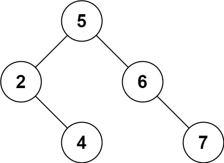

# 450. Delete Node in a BST

## Условие

Имея ссылку на корневой узел BST и ключ, удалите узел с заданным ключом из BST.
Верните ссылку на корневой узел (возможно, обновленную) BST.

В принципе, удаление можно разделить на два этапа:

1. Search for a node to remove.
2. If the node is found, delete the node.

Example 1:


Input: root = [5,3,6,2,4,null,7], key = 3
Output: [5,4,6,2,null,null,7]

Пояснение: Ключ для удаления равен 3. Поэтому мы находим узел со значением 3 и
удаляем его.

Один из допустимых ответов — [5,4,6,2,null,null,7], показанный в приведенном
выше BST.
Обратите внимание, что другой допустимый ответ — [5,2,6,null,4,null,7], и он
также принимается.



## Решение

Задача 450. Delete Node in a BST (Удаление узла в бинарном дереве поиска) — это
одна из самых комплексных и интересных задач на деревья уровня Medium. Она
проверяет не просто умение ходить по дереву, а понимание того, как перестраивать
связи между узлами, сохраняя свойства Бинарного Дерева Поиска (BST).

## Суть задачи

Тебе даны корень Бинарного Дерева Поиска (root) и ключевое значение key. Нужно
удалить узел с этим значением из дерева и вернуть измененный корень дерева.
Напомню главное свойство BST: для любого узла все значения в его левом поддереве
строго меньше его собственного значения, а в правом — строго больше.

## 💡 Суть решения: Три сценария удаления

Поиск узла происходит стандартно (если key меньше текущего — идем налево, если
больше — направо). Самое интересное начинается, когда мы нашли нужный узел.
Здесь возможны три ситуации:

1. Узел — это лист (нет детей):
   Самый простой случай. Мы можем просто удалить его, вернув null наверх его
   родителю.
2. У узела есть только один ребенок (левый или правый):
   Мы просто «вырезаем» текущий узел и соединяем его родителя напрямую с этим
   единственным ребенком. То есть возвращаем этого ребенка наверх.
3. У узла есть оба ребенка:
   Мы не можем просто удалить узел, иначе дерево распадется. Нам нужно найти ему
   достойную замену.

* Кем заменить удаляемый узел? Самым маленьким элементом в его правом
  поддереве (его называют Inorder Successor).
    * Мы спускаемся в правое поддерево и идем до упора налево. Находим там
      минимальное значение.
    * Копируем это минимальное значение в наш удаляемый узел.
    * Теперь у нас в дереве два одинаковых значения. Чтобы убрать дубликат, мы
      рекурсивно удаляем этот самый минимальный узел из правого поддерева.

## Код на Kotlin

```kotlin
class Solution {
    fun deleteNode(root: TreeNode?, key: Int): TreeNode? {
        if (root == null) return null

        // Шаг 1: Ищем узел для удаления
        if (key < root.`val`) {
            root.left = deleteNode(root.left, key)
        } else if (key > root.`val`) {
            root.right = deleteNode(root.right, key)
        } else {
            // Узел найден! Начинаем процесс удаления (Шаг 2)

            // Сценарий 1 и 2: Нет левого ребенка (возвращаем правый, даже если он null)
            if (root.left == null) {
                return root.right
            }
            // Сценарий 2: Нет правого ребенка (возвращаем левый)
            if (root.right == null) {
                return root.left
            }

            // Сценарий 3: Есть оба ребенка
            // Находим минимальный элемент в правом поддереве
            val minNode = findMin(root.right!!)
            // Заменяем значение текущего узла на минимальное из правого хвоста
            root.`val` = minNode.`val`
            // Рекурсивно удаляем дубликат из правого поддерева
            root.right = deleteNode(root.right, minNode.`val`)
        }
        return root
    }

    // Вспомогательная функция для поиска самого левого (минимального) узла
    private fun findMin(node: TreeNode): TreeNode {
        var current = node
        while (current.left != null) {
            current = current.left!!
        }
        return current
    }

}

```

## Пошаговый разбор сложного случая (Сценарий 3)

Представь дерево:

```text

      5
     / \
    3   6
   / \   \
  2   4   7

```

Мы хотим удалить узел 3 (key = 3).

1. Алгоритм находит узел 3. У него есть оба ребенка: левый (2) и правый (4).
2. Запускается функция findMin(root.right) от узла 4. Поскольку у 4 нет левых
   детей, сам узел 4 и является минимальным.
3. Мы перезаписываем значение в узле 3. Теперь дерево на мгновение выглядит так:

```text
     5
    / \
   4   6
  / \   \
 2   4   7

```

(Заметил? На месте тройки теперь стоит четверка, но внизу осталась старая
четверка).

4. Мы вызываем deleteNode(root.right, 4) для правого поддерева. Нижняя четверка
   удаляется по Сценарию 1 (так как она лист, вместо нее родителю возвращается
   null).
5. Финальное дерево сбалансировано и валидно:

```text
      5
     / \
    4   6
   /     \
  2       7

```

## Сложность

* Времени: $O(H)$, где $H$ — высота дерева. В лучшем/среднем случае (
  сбалансированное дерево) это составит $O(\log N)$. В худшем случае (если
  дерево выродилось в список) — $O(N)$.
* Памяти: $O(H)$ — на стек вызовов рекурсии.

